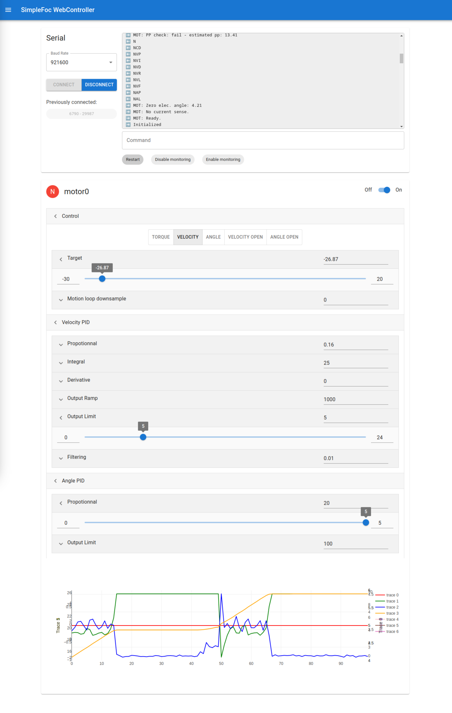

# Simple FOC Web Controller

This is a controller interface for the [Simple FOC library](https://github.com/simplefoc/Arduino-FOC). It uses WebSerial to communicate with a suitable micro-controller on which Simple FOC is used.

- Control multiple motors
- Motors auto-detection
- Motor monitoring with realtime graph
- No install needed

## How to use

- Configure and flash Simple FOC on the board of your choice following the [official documentation](https://docs.simplefoc.com/installation)
- Configure each of your motor to [use monitoring](https://docs.simplefoc.com/monitoring)
- If you which to control your motors through the web controller (and not only monitor them), configure [commander for the motor](https://docs.simplefoc.com/commander_interface)
- Go to [simplefoc.besson.co](https://simplefoc.besson.co) with a Chromium browser (or any browser with [WebSerial](https://caniuse.com/web-serial))
- Click on "Connect" and select your micro-controller
